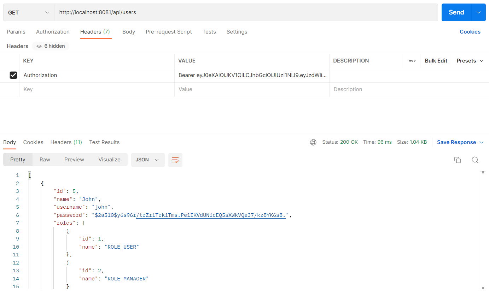

# Spring-Boot-Security-JWT
Spring Boot and Spring Security with JWT including Access and Refresh Tokens  
API: http://localhost:8081

# Postman
API: http://localhost:8081/api/login

API: http://localhost:8081/api/users `(invalid access token)`

API: http://localhost:8081/api/users `(valid access token)`

API: http://localhost:8081/api/token/refresh `(valid refresh token)`

